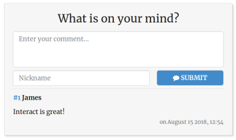
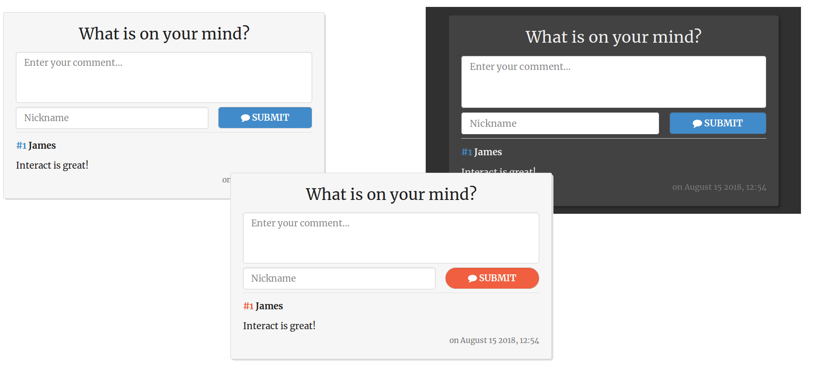
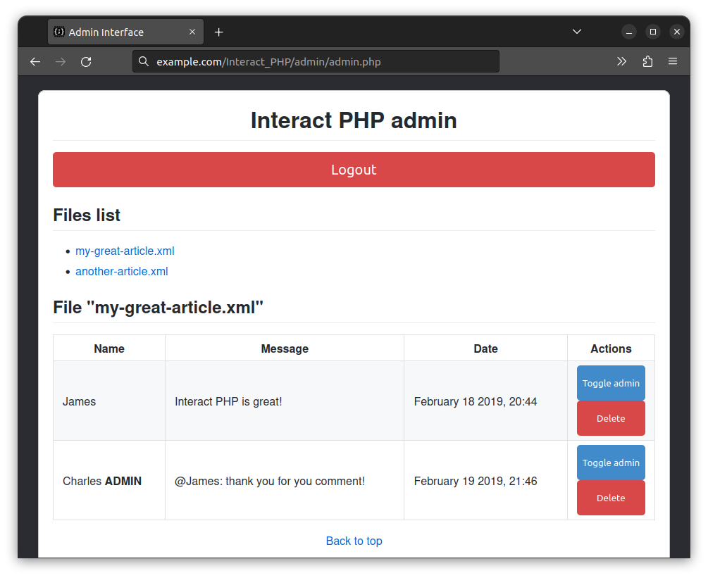

# Interact PHP - simple comment system

## Purpose

Interact is a simple PHP open-source comment system that can be added to any website in minutes to improve interactivity and user's involvement. Client-side, it is very lightweight (<6KB CSS and JS combined) and intuitive (no logins, no cookies,...). Server-side, it is very easy to setup, manage and even customize to fit your needs.



Similarly to its older brother [HashOver](http://tildehash.com/?page=hashover), Interact does not use an SQL database but stores comments as XML files. Many third-party comment systems like Disqus, IntenseDebate, Livefyre, Facebook Comments and Google+ Comments, suffer from these problems and impose them and many other restrictions onto their users, meaning you and your website's visitors.

## Features

* **No dependency**.
* **Fast** and convenient for your users with responsive design.
* Very **simple** setup: no database to configure, just install it and add 2 lines of PHP where you want your comment section to be.
* Easily **customizable** style and behavior to match the look & feel of your website.
* **Anti-Spam** system using Google's reCAPTCHA v2 *(optional)*.
* **Pure JS** (no JQuery required).
* **Secure** by design.
* Inline **Markdown syntax** support in comments (**bold**, *italics*, ~~strike-through~~ and `inline code`) *(can be disabled)*.
* **Open-source** (MIT license).
* **W3C compliant** and follows accessibility rules.

## Installation and setup

**Requirements:** PHP≥5, php-xml.

1. Download/clone [Interact on GitHub](https://github.com/CGrassin/interact_php).
2. Put the "Interact_PHP" folder under your website's root (or relocate the folder where you want and change the `LIBRARY_ROOT` setting accordingly).
3. *Optional*: customize Interact's behavior to your needs by editing the *Interact_PHP/settings.php* file and/or the *Interact_PHP/strings.xml*.
4. Give the directory that will contain the comments 777 permission (`chmod -R 777 path/to/interact_php/Comments`). Alternatively, `chown` the folder to the user that is configured to execute PHP scripts as, for example "www-data". And then simply give the "path/to/Interact_PHP/Comments" directory permissions "755". 

Hurray, Interact is ready to go! To add a comment section to a page, just insert the following PHP in any page:
```php
<?php 
    include_once($_SERVER['DOCUMENT_ROOT'].'/interact_php/Interact_PHP.php');
    \Interact_PHP\Interact_PHP("<some-id-such-as-article-title>"); 
?>
```

The parameter `<some-id-such-as-article-title>` is what will be used to associate the comments with this form. If you call `\Interact_PHP\Interact_PHP()` without an argument, it creates an ID from the URL, but this is not recommended.

You can call `\Interact_PHP\Interact_PHP()` multiple times per page if you need multiple comment forms (e.g. a page with several articles).

## Parameters and customization

All of the core parameters of Interact are in the *settings.php* file. There are a lot of comments to assist you in the configuration process. Some of them, like enabling reCAPTCHA are highly recommended.

### Look and feel

Several CSS files are included with Interact PHP. If you want to add your own style, copy an existing CSS file to get started... and commit it on GitHub if you want to contribute to Interact's ongoing development!



### Internationalization

Interact PHP supports full internationalization: all user-visible strings are stored in a "string.xml" file. You can edit this file to match your website or add translations, and call `\Interact_PHP\Interact_PHP("<some-id-such-as-article-title>", "language")` with another parameter "language" that is the desired language to display.

If you need a single display language, you can just customize the "default" language.

### Admin interface

If you set up a value for `ADMIN_PASSWORD`, Interact PHP enables a very simple admin interface that allows to delete and promote comments (to show an "Author" badge).



It is accessible from the url: `https://your_website_url/path/to/interact_php/admin/admin.php`.

**Note about security:** Interact PHP only stores a hash of the password, and the absolute worst that can happen if a bad actor were to gain access would be the ability to remove comments, which is negated by doing backups of the comment files (anyway recommended). Regardless, I would highly advise only enabling this admin interface if the two conditions below are met:
1. Your website uses HTTPS,
2. You either enabled the reCAPTCHA anti-spam system for Interact PHP and/or you have another way to prevent brute-forcing on your website.

## Troubleshooting

This section describes the various problems you may encounter while installing/using Interact. If you don't find a solution here, please add a GitHub issue.

* **I can't add comments**

You should check the permissions of the folder containing the comments (*Interact/Comments* by default). The PHP user must be able to write there. Setting 777 works (`chmod -R 777 Comments`).

If the libxml PHP library is not enabled, installing should fix the issue (e.g. `sudo apt-get install php-xml`, restart Apache when completed).

* **The CSS does not load**

The path of the library relative to the root of your website is probably incorrect. Make sure it matches with the value in *settings.php*. By default, it is */interact_php*.

* **I am getting reCAPTCHA errors even after checking the box**

You need to make sure that your reCAPTACHA public and secret keys are correct. Interact uses reCAPTCHA v2. More info at https://developers.google.com/recaptcha/docs/display

## Future features/work in progress

This is the list of future features, by priority:
* New feature: collapsible comment box if more than the comment box is higher than N pixels or N comments
* New feature: option to forbid links in comments
* New feature: optional hidden email field to allow the webmaster to contact users

<!-- Scratchpad: reCaptcha v3 support -->

Please submit a [GitHub issue](https://github.com/CGrassin/interact_php/issues) for feature requests or bug reports.

## License

This library is published under MIT license.

